# Structure of HTTP Request and Response

## Phần 1: HTTP Request
- Để bắt đầu trao đổi dữ liệu, client khởi tạo một HTTP secsion bằng cách mở một kết nối TCP đến HTTP server sau đó gửi request đến server này.
- Một HTTP client gửi một HTTP request tới server theo định dạng sau:

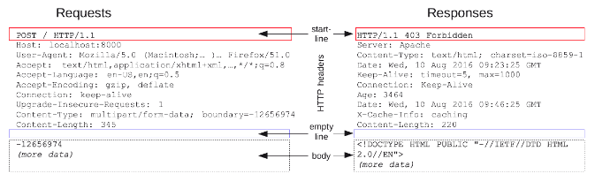

### Request-Line

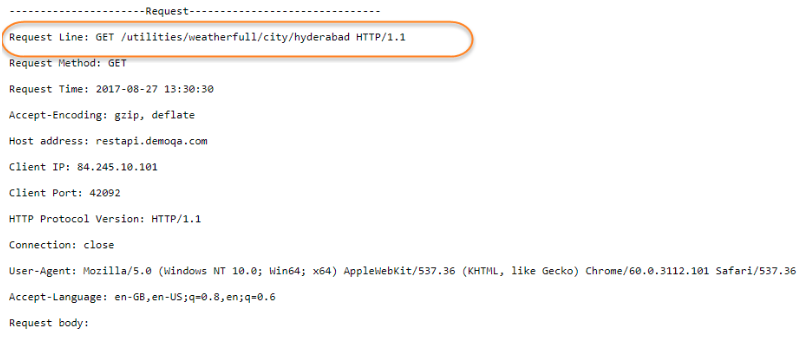

- Request-Line bao gồm 3 thông tin:
	+ Method: Là phương thức mà HTTP Request này sử dụng, thường là GET, POST, ngoài ra còn một số phương thức khác như HEAD, PUT, DELETE, OPTION, CONNECT.
		+ GET: request lấy dữ liệu từ server, không tác động gì tới server (thêm, sửa, xóa). Không sử dụng GET để gửi các thông tin quan trọng.
		+ POST: Sử dụng để gửi gửi dữ liệu lên server (Dữ liệu quan trọng), có tác động lên server (thêm, sửa, xóa)
		+ PUT: Sửa đổi dữ liệu
		+ DELETE: Xóa dữ liệu được chỉ định
		+ HEAD: Yêu cầu response giống như GET nhưng không có response body.
		...
	+ URI (Uniform Resource Locator): Là địa chỉ định danh của tài nguyên. Hiểu đơn giản, URI là đường dẫn để lấy resource. Trong trường hợp Request không yêu cầu tài nguyên cụ thể, URI có thể là dấu *.
		+ http/https: protocol là một method thiết lập để trao đổi hoặc truyền dữ liệu xung quanh mạng.
		+ Domain name: Chỉ ra server nào đang được request
		+ Port: cổng sử dụng để truy cập resource trên server. Nó thường bị bỏ qua nếu máy chủ web sử dụng các cổng tiêu chuẩn cảu giao thức HTTP. Nếu sử dụng các cổng khác thì phải bắt buộc chỉ rõ 				port.
		+ Path: Là đường dẫn tới resource trên server.
		+ Parameters: Các param (key-value) bổ sung được cung cấp cho server. 
	+ HTTP version: Là phiên bản HTTP đang sử dụng.

### Request Header
- Request-header cho phép client thêm các thông tin bổ sung về HTTP Request. Các trường này đóng vai trò là công cụ sửa đổi request.
- Request header tuân theo cùng cấu trúc cơ bản của HTTP header: Chuỗi không phân biệt hoa thường theo sau là dấu hai chấm (':') và giá trị có cấu trúc phụ thuộc vào header.
- Một request có thể chứa nhiều header hoặc có thể không có header. Phần Header được tính từ sau *Request Line* đến trước *Request Body*.
- Header có thể được nhóm theo bối cảnh của chúng:
	+ General header: Có thể được sử dụng cho cả request và response nhưng không áp dụng đối với các nội dung trong body. Ví dụ: Date, Cache-Control, Connection
	+ Request header: Sử dụng trong một HTTP request, và không liên quan đến nội dung của message. Chứa thông tin về resource hoặc về client.
		+ Accept, Accept-* or If-*: cho phép thực hiện các request có điều kiện.
		+ Cookie, User-Agent, Refere: Chỉ rõ bối cảnh để server có thể điều chỉnh response.
	+ Response header: Thông tin bổ sung về response như location hoặc thông tin về server (name/version...). Có thể sử dụng cho HTTP response và không liên quan tới content của message. Ví dụ: Age, 					Location, Server...
	+ Entity header: Chứa thông tin về body của entity như độ dài nội dung hoặc MIME-type. Được sử dụng cho cả request và response. Ví dụ như Content-Lenght, Content-Language, Content-Encoding

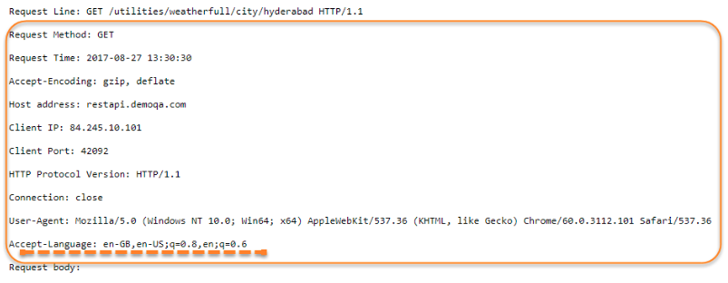

- Danh sách một số HTTP-header thường dùng:
	+ Accept: Loại bỏ nội dung có thể nhận được từ thông điệp response. Ví dụ: text/plain, text/html...
	+ Accept-Language: Chỉ ra ngôn ngữ mà client có thể hiểu. 
	+ Accept-Encoding: Các kiểu nén được áp dụng. Ví dụ: gzip, xz, exi...
	+ Connection: Tùy chọn điều khiển cho kết nối hiện thời. Ví dụ: Keep alive, Upgrade...
	+ Cookie: Thông tin HTTP Cookie từ server
	+ User-Agent: thông tin về user agent của người dùng.
	+ Content-Encoding: được sử dụng để nén media-type như gzip, compress, deflate, identity, br.
	+ Content-Language: Được sử dụng để mô tả các ngôn ngữ.
	+ Content-Length: Chỉ ra kích thước của entity-body, tính bằng byte, được gửi đến người nhận.
	+ Content-Type: Chỉ ra các media-type của resource.

### Request Body

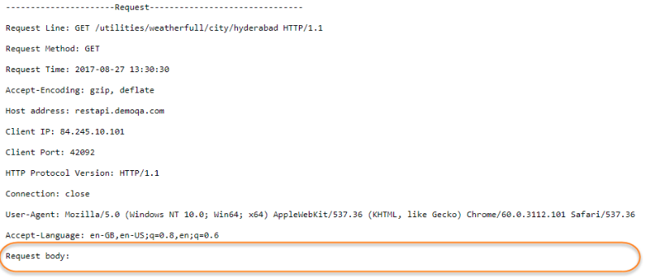

- Là một tùy chọn cho một HTTP message, thường dùng với POST, PUT request. Các request như GET, HEAD, DELETE hay OPTIONS thường không có.
- Là phần mang nội dung bổ sung để gửi đến server.
- Body có thể được chia làm 2 loại:
	+ Single-resource bodies: Bao gồm một file duy nhất, được xác định bởi hai tiêu đề: Content-Type và Content-Lenght.
	+ Multiple-resource bodies: Bao gồm một multipart body, mỗi phần chứa một thông tin khác nhau.

## HTTP Response
- Gói thông tin được gửi từ server về client để đáp ứng request gửi lên.
- Cấu trúc của HTTP response gần giống với HTTP Request, chỉ khác nhau Request-Line với HTTP request và Status-Line với HTTP-Response.

### Status-Line
- Status-Line cũng có 3 phần như sau:
	+ HTTP-version: Phiên bản HTTP cao nhất mà server hỗ trợ.
	+ Status-Code: Mã kết quả trả về
	+ Reason-Phrase: Mô tả về Status-Code

- Status-Code thông dụng mà server trả về cho client như sau:
	+ 1xx: Information Message: Các status-code dạng này chỉ có tính chất tạm thời, client có thể không quan tâm.
	+ 2xx: Successful: Khi đã xử lý thành công request của client, server sẽ trả về status dạng này.
		+ 200 OK: request thành công.
		+ 202 Accepted: request đã được nhận, nhưng không có kết quả nào trả về, thông báo cho client tiếp tục chờ đợi.
		+ 204 No Content: request đã được xử lý nhưng không có thành phần nào được trả về.
		+ 205 Reset: Giống như 204 nhưng mã này còn yêu cầu client reset lại document view
		+ 206 Partial Content: server chỉ gửi về một phần dữ liệu, phụ thuộc vào giá trị range header của client đã gửi.
	+ 3xx: server thông báo cho client phải thực hiện thêm thao tác để hoàn tất request
		+ 301 Moved Permanently: tài nguyên đã được chuyển hoàn toàn tới địa chỉ Location trong HTTP response.
		+ 303 See other: tài nguyên đã được chuyển tạm thời tới địa chỉ Location trong HTTP response.
		+ 304 Not Modified: tài nguyên không thay đổi từ lần cuối client request, nên client có thể sử dụng response đã lưu trong cache.
	+ 4xx: Client error: lỗi client
		+ 400 Bad request: request sai định dạng
		+ 401 Unauthorized: client chưa xác định
		+ 403 Forbiden: client không có quyền truy cập
		+ 404 Not Found: không tìm thấy resource
		+ 405 Method Not Allowed: phương thức không được server hỗ trợ
	+ 5xx Server error: Lỗi server
		+ 500 Internal Server Error: có lỗi trong quá trình xử lý server
		+ 501 Not Implemented: server không hỗ trợ chức năng client yêu cầu.
		+ 503 Service Unavailable: Server bị quá tải, hoặc bị lỗi.

### Response Header
- Giống như request header.
- Response header có thể có hoặc không. Được tính từ sau dòng *Status Line* và trước *Response Body*.
- Được sử dụng để truyền thông tin bổ sung tới client.

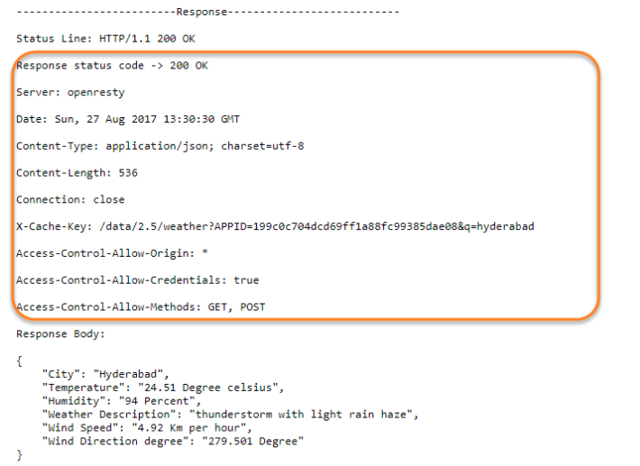

- Trong Response header có header tên *Content-Type* với giá trị là *application/json; charset=utf-8*, điều này có nghĩa là server thông báo rằng response body trả về chứa dữ liệu được định dạng JSON.

### Response Body
- Chứa data đáp ứng request từ client.
- Có thể có hoặc không, ví dụ như response status 201, 204 thường không có.

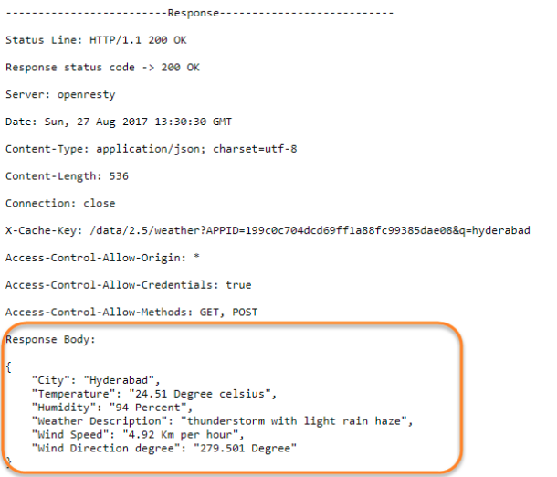

## Phần 2: Thực hành với Postman

#### Thực hành
- GET Request on Postman: Endpoint: http://restapi.demoqa.com/customer/register
	+ Send request:
		
		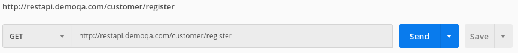

	+ Xem HTTP status code, nó sẽ trả về *405 Method not allowed*. Có nghĩa là phương thức này không chính xác.

		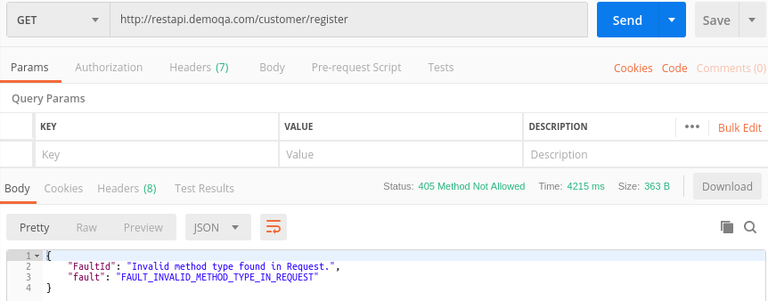

	+ Phần body, và để ý dòng error được trả về.

		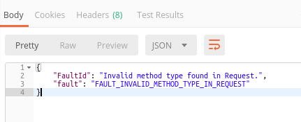

- POST Request không có body
	+ Thay đổi loại phương thức GET thành POST và Send request.

		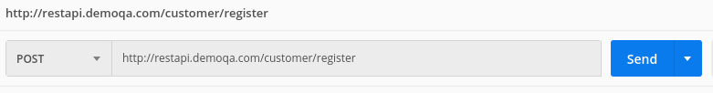

	+ Kiểm tra response và status code.

		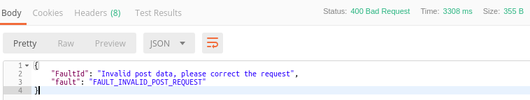

	+ Error trả về là "FAULT_INVALID_POST_REQUEST" có nghĩa là dữ liệu POST không hợp lệ. Status code "400 BAD Request", có nghĩa là các tham số request không khớp với các tham số trên server để nhận được response.

- POST Request có body.
	+ Thêm một body vào POST Request. Dữ liệu gửi lên dưới dạng JSON.

		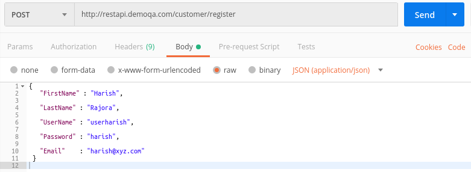

	+ Kiểm tra response.

		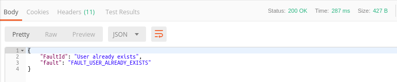

	+ Status code: 200 OK, nghĩa là server đã chấp nhận request và gửi lại response. Phần Response body trả về "Fault User Already Exits" có nghĩa là User này đã tồn tại.

### Các cách gửi dữ liệu với POST method
- Về cơ bản, có 4 cách để gửi dữ liệu đến server
	+ multipart/form-data
	+ application/x-www-form-urlencoded
	+ application/json (raw)
	+ binary

	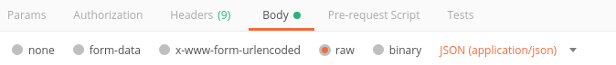

#### Multipart/form-data
- Sử dụng để gửi dữ liệu đóng gói bên trong form dưới dạng các cặp KEY_VALUE. Các cặp KEY-VALUE được phân tách nhau bởi '&' và KEY-VALUE phân tách nhau bởi '='
- Về cơ bản nó giống với content type "application/x-www-form-urlencoding", nhưng "application/x-www-form-urlencoding" không hiệu quả để gửi với số lượng lớn dữ liệu nhị phân hoặc văn bản có chứa các ký tự không phải ASCII. Vì thế form-data được sử dụng để thay thế.

	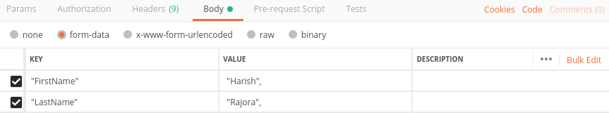

	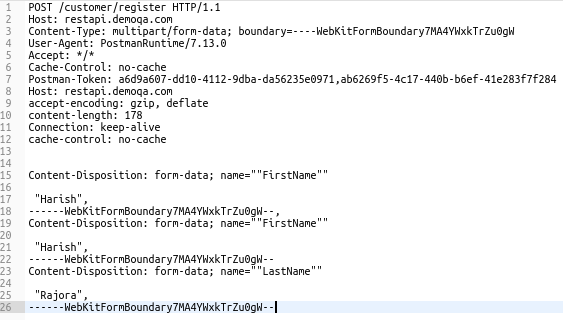

- Nó cũng có thể file lên server.

	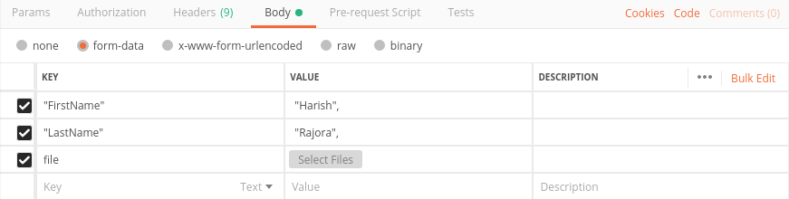

#### application/x-www-form-urlencoded
- Về cơ bản nó tương tự như *Multipart/form-data*. Sử dụng nếu muốn gửi dữ liệu dạng text/ASCII đơn giản.
- Điểm khác là URL sẽ được mã hóa khi gửi.
- Lưu ý, không thể dùng Annotation này với các request GET. Ngoài ra cần sử dụng @Field cho các tham số mà sẽ gửi với request.

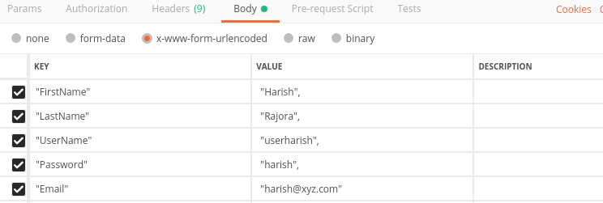

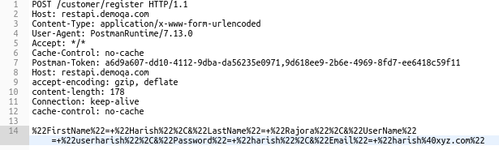

#### application/json (raw)
- Đây là option hay được dùng nhất khi gửi body trong POST method, dữ liệu gửi lên dưới dạng JSON.

	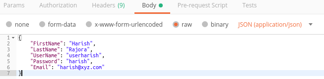

	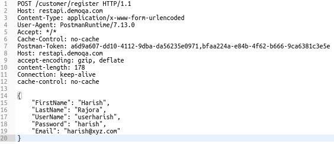

#### Binary
- Được thiết kế để có thể gửi dữ liệu lên server dưới dạng binary khi muốn đính kèm dữ liệu phi văn bản (video, audio, images, bất cứ dữ liệu nhị phân nào) vào request.
- Sử dụng với dữ liệu không thể nhập thủ công.

	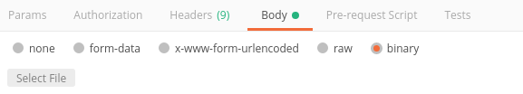

## RESTful basic
- Để có thể thiết kế API RESTful, trước tiên cần phải hiểu REST.
- Xu hướng thiết kế web service trước kia từng là SOAP, WSDL,.. nhưng hiện nay có phương pháp tốt hơn đó là: REST
- REST (Representation State Transfer) là một kiểu kiến trúc lập trình, định nghĩa các quy tắc để thiết kế web service tập trung vào resource. Mọi thứ trong REST để được coi là resource và được định danh thông qua URI. Resource có thể là dạng TEXT, XML, JSON,...
- RESTful là những ứng dụng có sử dụng kiến trúc REST.

### Những ràng buộc trong REST
- Client-Server: Hoạt động theo mô hình Client-Server, việc tách biệt này nhằm đơn giản hóa việc thực hiện các thành phần, giảm sự phức tạp. Các thành phần Client và Server có thể phát triển độc lập. Server có thể phục vụ nhiều Client.

- Stateless: Server và Client không lưu trạng thái của nhau. Mỗi request được gửi đi đều phải được đóng gói đầy đủ thông tin để server có thể nhận và hiểu được. Điều này giúp hệ thống dễ phát triển, bảo trì, mở rộng vì không tốn công CRUD trạng thái Client. Tuy nhiên, hạn chế là làm tăng lưu lượng thông tin cần truyền tải giữa client và server.

- Cache: Các response có thể lưu trong bộ nhớ cache của Client vì thế các response từ server chứa thông tin để cho biết client có thể lưu trữ response trong cache không. Việc này được thực hiện thông qua Response Header.

- Uniform Interface: Giao diện thống nhất là cơ bản để thiết kế bất kỳ dịch vụ REST nào. Giao diện thống nhất đơn giản hóa và tách rời kiến trúc, cho phép mỗi phần phát triển độc lập.

- Layered System: Mỗi lớp trừu tượng hóa hóa chức năng nhất định của hệ thống tổng thể. Một lớp không nên biết về sự tồn tại của lớp khác ngoài các lớp mà nó tương tác. Làm giảm độ phức tạp của hệ thống, giúp các thành phần tách biệt nhau, dễ dàng mở rộng.

- Code on demand: Đây là option. Client có thể mở rộng chức năng của mình bằng cách tải xuống code từ server (dạng Applet, Script). Việc server gửi code về client sẽ xuất hiện mối lo ngại về bảo mật.

### REST và SOAP
- Ngày nay, 2 phương pháp thường dùng để giao tiếp với ứng dụng web là: SOAP (Simple Object Access Protocol) và REST (Representation State Transfer). Cả 2 giải pháp này để là những lựa chọn tốt khi thiết kế hệ thống, nhưng nó cũng có nhược điểm riêng. Vì vậy, việc lựa chọn phương pháp nào tùy thuộc vào người phát triển hệ thống và từng trường hợp cụ thể.

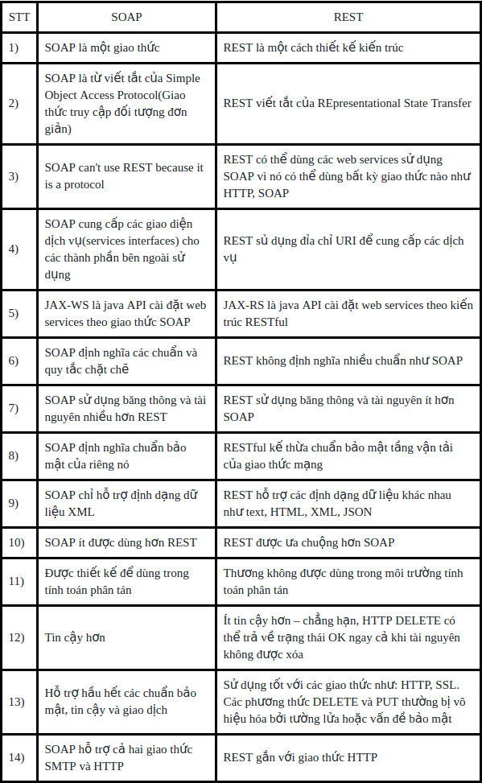

## Tài liệu tham khảo
- https://developer.mozilla.org/en-US/docs/Web/HTTP/Messages
- https://www.stdio.vn/articles/http-request-va-http-response-202
- https://stackoverflow.com/questions/16958448/what-is-http-multipart-request
- https://www.toolsqa.com/postman/post-request-in-postman/
- https://www.toolsqa.com/client-server/http-response/
